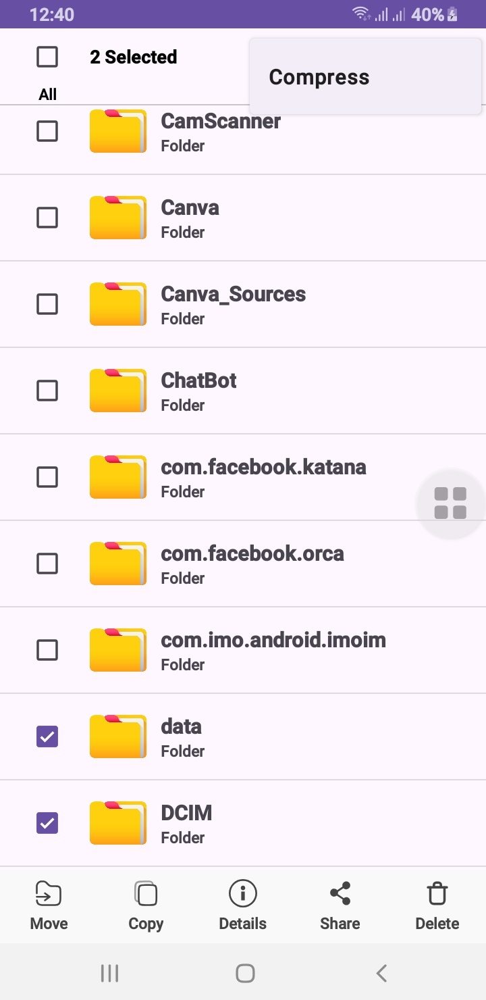

# 📁 File Manager Pro — Android App

**File Manager Pro** is a modern, powerful Android file manager app built with Java.  
It provides all essential file operations with a smooth user experience and a professional UI.

---

## 🚀 Features

- 📂 Browse files & folders in storage
- 📋 Copy, Move, Paste with multi-item support
- 🗑️ Delete & 📝 Rename files or folders
- 📄 View detailed file info
- 📦 Compress and Extract ZIP files
- 🔁 Restore scroll position when navigating back
- 🔧 Modern UI With Recycler View
- 🔐 Storage support Android 7+

---

## 📸 App Screenshot

---

## 📺 Watch the App in Action (YouTube Shorts)

---

## 💻 Get the Free Source Code

Download this project and many other Android apps for free at:  
👉 **[https://alsaeeddev.com](https://alsaeeddev.com)**

No sign-up required — just download and build.

---

## 🛠️ Requirements

- Android Studio Narwhal or later
- Java 17+
- Minimum SDK: 24 (Android 7.0)
- Target SDK: 36 (Android 16)

---

## 🐛 Bug Reports & Suggestions

If you encounter any bugs or have suggestions to improve this project, feel free to reach out.  
📧 I'm always open to feedback and happy to help – email me at: **alsaeeddev@gmail.com)**

---

## 📄 License

This project is licensed under the [MIT License](LICENSE) – free to use, modify, and distribute.

